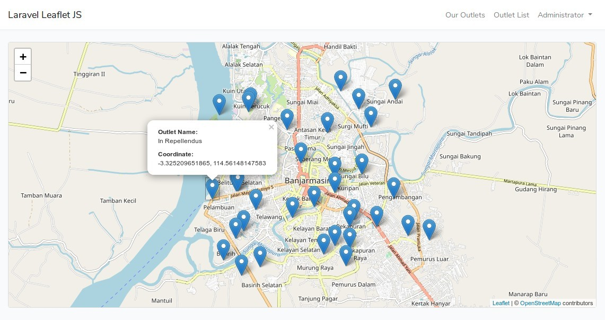

# Laravel Focos de Calor ECEM

proyecto creado para determinar focos de calor en las diferentes jurisdicciones del pais, y poder tener una alerta temprana.
desarrollado para la tesis alumno ECEME

php 7.X
Postgres

This is an example project for [Leaflet JS](https://leafletjs.com) and [OpenStreetMap](https://www.openstreetmap.org) built with Laravel 5.8.

